# Student Portal

A web-based student management system for colleges, training centres and tuition centres, built with Laravel 13, Blade and plain CSS. It covers student records, departments, terms, a weekly timetable with classrooms and clash checks, subject registration into sessions, marks with lecturer approval, GPA/CGPA, transcripts, fees with printed receipts, a statistics page for management, and eight user roles. The super admin can rebrand the whole system (logo, colours, font) without touching code.

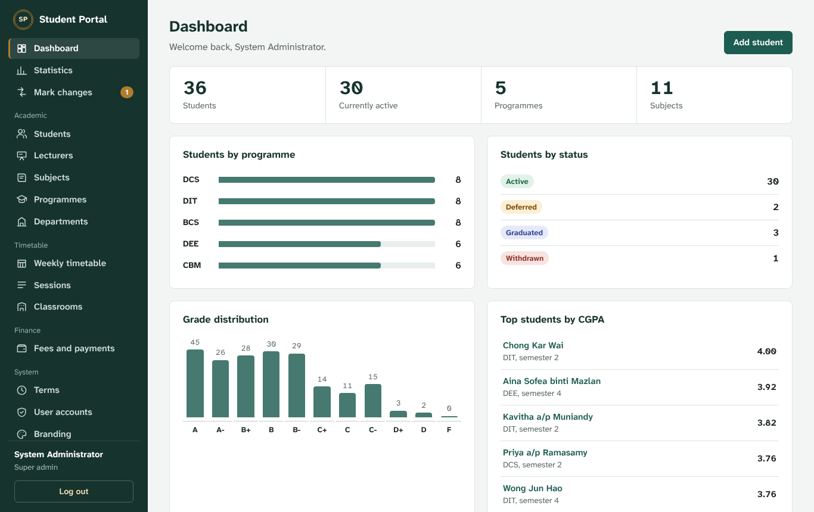

## Roles

Each person sees only the menus, pages and buttons their role allows.

| Role | Can do |
|---|---|
| **Super admin** | Everything, plus branding, user accounts, departments, terms and changing marks directly |
| **Management** (Director / COO / CEO) | See everything, change nothing: the statistics page, students, results, fees and payments, timetable |
| **Admin staff** | View students, lecturers and subjects; edit students' personal and contact details; add and edit classrooms. Cannot see results |
| **Head of department** | For the departments they head: manage subjects and their lecturers, sessions and the timetable, and request mark changes. Can view all results |
| **Registrar** | Add and edit students, register them into sessions, see results (read-only), print transcripts, reset student passwords |
| **Lecturer** | Enter marks for the students of their own sessions; approve or reject mark change requests for them; see their own timetable |
| **Accountant** | Bill fees (one student or a whole programme), record payments, print receipts, see who owes money |
| **Student** | See their own subjects, results, transcript and timetable |

All permissions live in one file, `config/roles.php`, so they can be adjusted for each client.

## Features

- **Student records:** search, filters, Excel (CSV) export, and a profile page with GPA per semester and CGPA.
- **Automatic student logins:** adding a student creates their login. The first password is their student number, and they must change it at first login.
- **Departments:** each department has one head of department; one head can lead several departments. Programmes and subjects belong to a department.
- **Several lecturers per subject:** a head of department chooses the subject's lecturers, then which of them teach each session.
- **Terms and sessions:** each term (e.g. September 2026) has its own sessions. A subject can run several sessions (Group A, Group B), each with its own lecturers, student limit and class times. The super admin sets the current term.
- **Weekly timetable:** class times in classrooms, shown as a weekly grid for the whole college, a department, a lecturer, a room, or each lecturer's and student's own timetable. A class time is refused if the room, a lecturer or the session is already busy.
- **Subject registration:** the registrar registers a student into one session per subject. Full sessions and timetable clashes are refused, and the session's lecturers enter the marks.
- **Mark change approval:** a head of department's change takes effect only after a lecturer of the student's session approves it, and every request and decision is kept.
- **Statistics for management:** students by programme and status, registrations and marking progress, pass rate and CGPA, fees collected and owed, monthly collections and room use, on one printable page.
- **Transcripts and receipts:** A4 layouts you can print or save as PDF, carrying the institution's logo and name.
- **Fees:**
  - running statements per student
  - balances showing amount owing or credit
  - one-click billing for a whole programme (safe to run twice)
  - receipt numbers in the format RCP-2026-00001
- **Branding page:** logo upload, portal and institution names, three colours with a live preview, and a choice of eight fonts. Colours too light for white text are refused.
- **Security:**
  - role checks on every page and action
  - login rate limiting per email address
  - hashed passwords and CSRF protection
  - validation on every form
  - result URLs scoped to their student
- **Responsive:** works on phones and tablets.
- **Automated tests:** 112 tests, including a check that every role can open only its own pages, and the timetable clash rules.

| Weekly timetable | Statistics (management) |
|---|---|
| 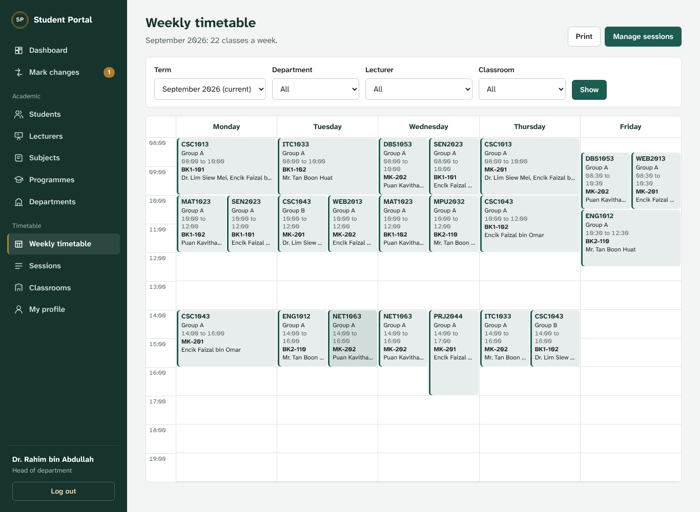 | 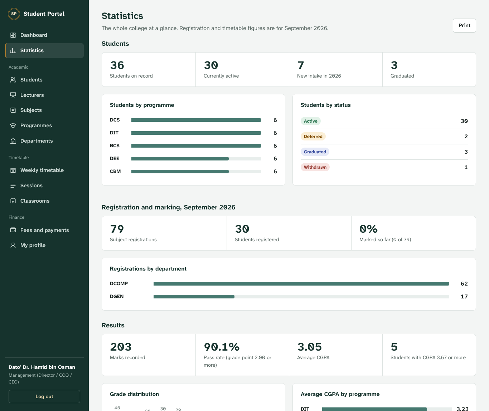 |

| Clash check when adding a class time | Registering a student into sessions |
|---|---|
| 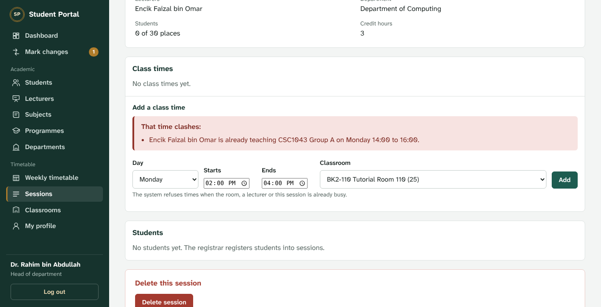 | 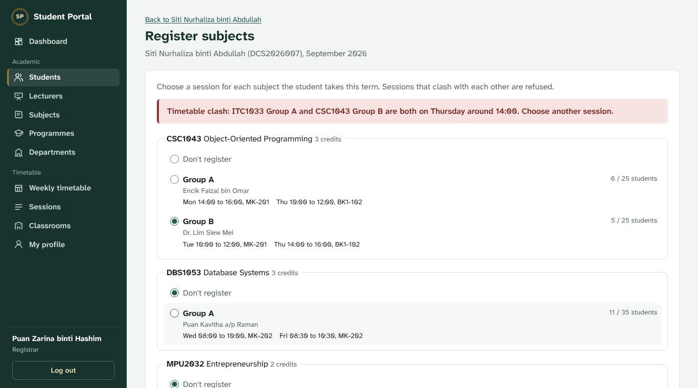 |

| Mark change approval | Fees and payments |
|---|---|
| 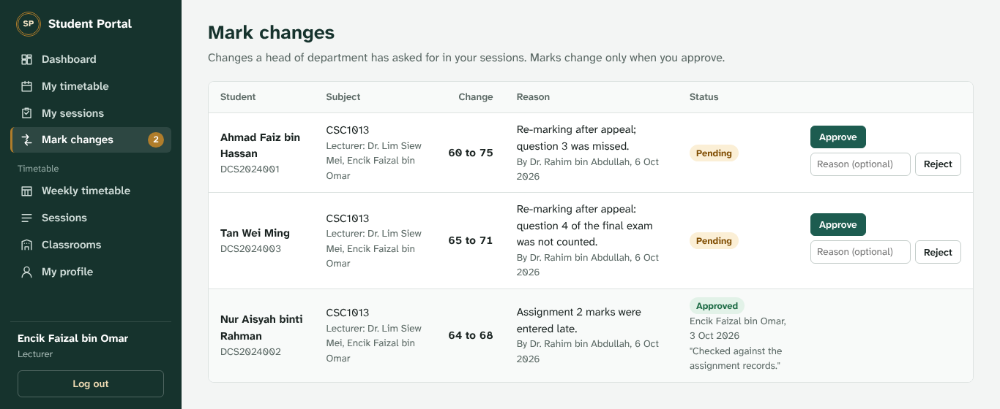 | 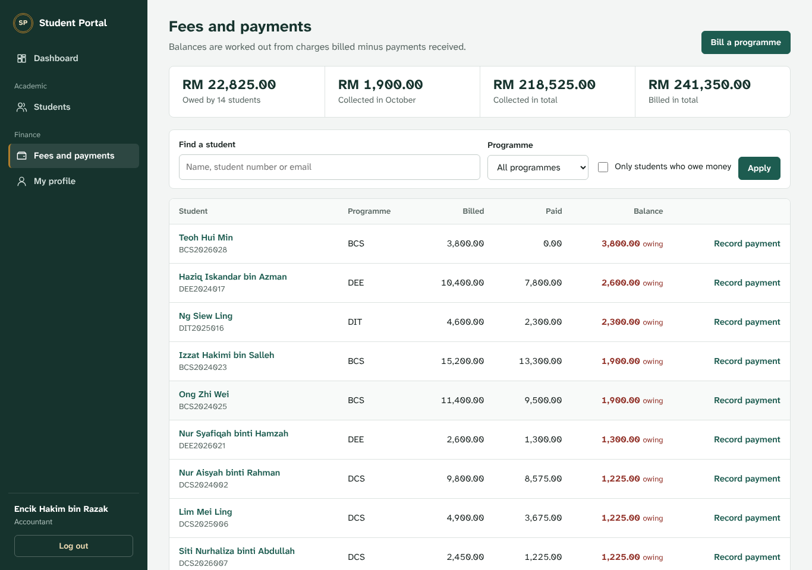 |

| Student record | Official receipt |
|---|---|
| 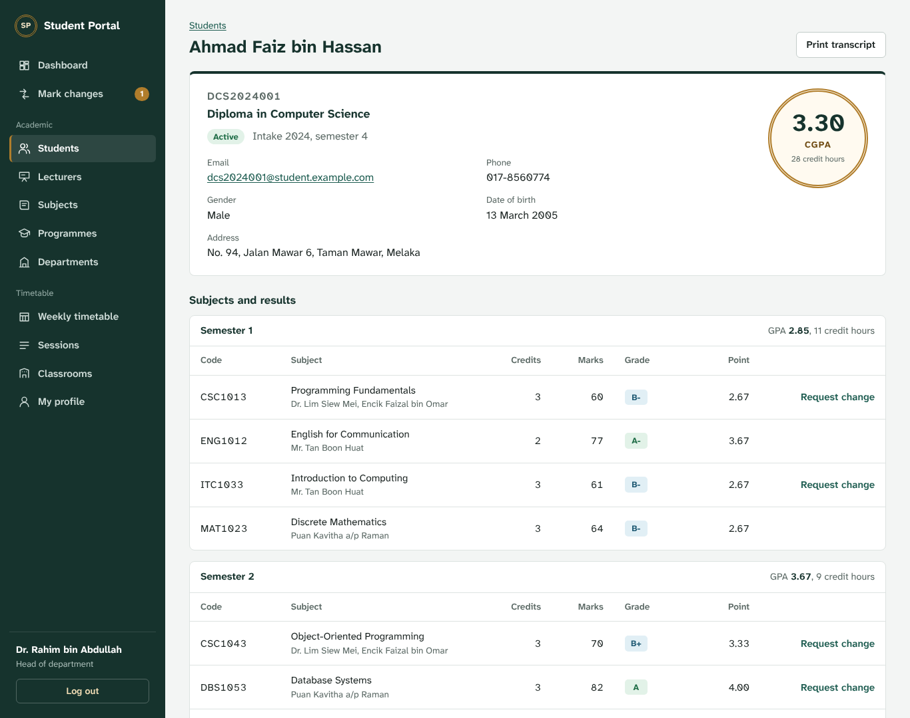 | 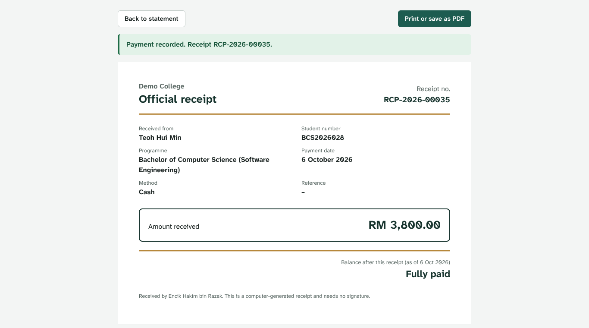 |

| Branding (super admin) | Printable transcript |
|---|---|
| 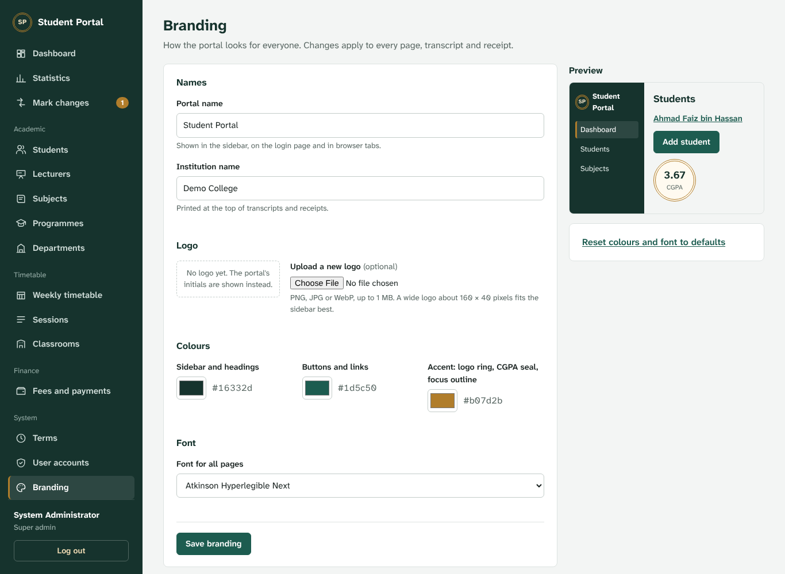 | 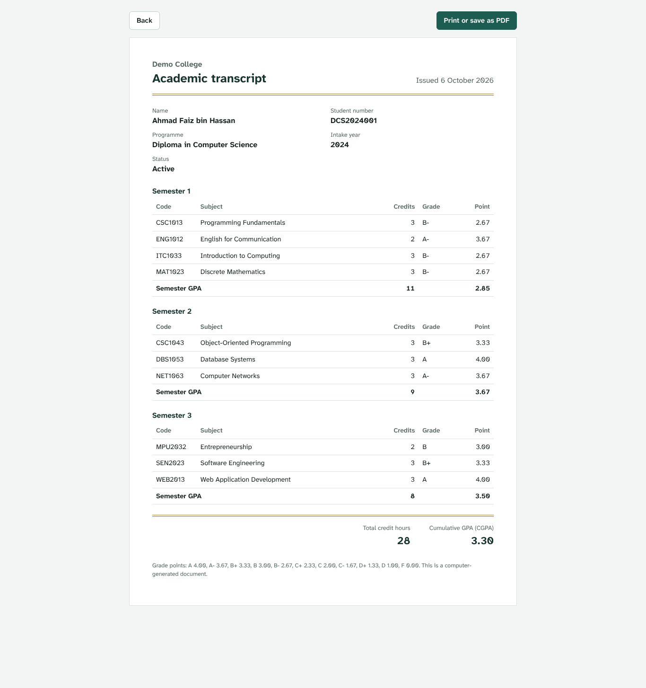 |

## Tech stack

- PHP 8.3+ and Laravel 13
- Blade templates and components, with plain CSS (no build step needed)
- SQLite by default; works with MySQL or MariaDB
- PHPUnit for tests

## Getting started

```bash
git clone https://github.com/<your-username>/student-portal.git
cd student-portal
composer install
cp .env.example .env
php artisan key:generate
php artisan migrate
php artisan db:seed      # optional: sample data and a demo login for every role
```

With [Laravel Herd](https://herd.laravel.com), put the folder in your Herd directory and open `http://student-portal.test`. Without Herd, run `php artisan serve` and open `http://127.0.0.1:8000`.

### Upgrading a system that is already running

Copy in the new files, then run `php artisan migrate`. Moving to version 3 keeps all existing data:

- teacher accounts become lecturer accounts and keep their subjects
- students still waiting for marks are put into a "Group A" session of each subject in the current term (a term called "Current term" is created if there is none; rename it under **Terms**)

Then, as super admin, add the departments and their heads, the terms and the classrooms, and give each programme and subject its department.

### Demo accounts (after `db:seed`)

All staff passwords are `password`.

| Role | Email |
|---|---|
| Super admin | `admin@example.com` |
| Management (Director) | `director@example.com` |
| Admin staff | `adminstaff@example.com` |
| Head of department | `hod@example.com` (Computing); `hod2@example.com` (Engineering and General Studies) |
| Registrar | `registrar@example.com` |
| Lecturer | `lecturer@example.com` (also `lecturer2@`, `lecturer3@`, `lecturer4@`) |
| Accountant | `accountant@example.com` |
| Student | `dcs2024001@student.example.com`, password `DCS2024001` (asked to choose a new one) |

Change or delete these accounts before putting the system online.

## Customising for a client

| What | Where |
|---|---|
| Logo, portal name, institution name, colours, font | Log in as super admin, then go to **Branding** |
| Departments and their heads | Super admin: **Departments** |
| Terms and the current term | Super admin: **Terms** |
| Classrooms | Admin staff or super admin: **Classrooms** |
| Timetable hours (08:00 to 20:00) and teaching days | `app/Support/Timetable.php` |
| What each role can do | `config/roles.php` |
| Grading scale (marks, grades, grade points) | `config/grading.php` |
| Currency shown on fees and receipts | `.env`: `PORTAL_CURRENCY="RM"` |
| Font choices offered on the Branding page | `config/portal.php` |
| Student statuses, genders, programme levels, payment methods, room types | the constants in `app/Models/Student.php`, `Programme.php`, `Payment.php` and `Classroom.php` |

## Using MySQL instead of SQLite

Create an empty database, then update `.env`:

```env
DB_CONNECTION=mysql
DB_HOST=127.0.0.1
DB_PORT=3306
DB_DATABASE=student_portal
DB_USERNAME=root
DB_PASSWORD=
```

Then run `php artisan migrate --seed`.

## Running the tests

```bash
php artisan test
```

## Where things are

```
app/Http/Controllers/   One controller per area: students, registrations, marks, mark changes,
                        lecturers, subjects, programmes, departments, terms, classrooms,
                        sessions, timetable, statistics, finance, payments, charges, billing,
                        users, branding, profile, dashboard
app/Models/             Student, Result, Subject, Programme, Department, Term, Classroom,
                        ClassSession, TimetableSlot, User, Charge, Payment,
                        ResultChangeRequest, Setting
app/Support/            Grading (GPA/CGPA), Timetable (clash checks, weekly grid),
                        Branding (logo, colours, font), Color (contrast checks)
config/roles.php        Roles and permissions
config/grading.php      The grading scale
config/portal.php       Default names, colours, fonts and currency
database/migrations/    Table definitions
database/seeders/       Sample data and demo accounts
resources/views/        Blade templates (layouts, components and one folder per area)
public/css/app.css      All styles
public/uploads/         Uploaded logo (not committed to Git)
routes/web.php          All URLs and who can open them
tests/Feature/          Automated tests
```
